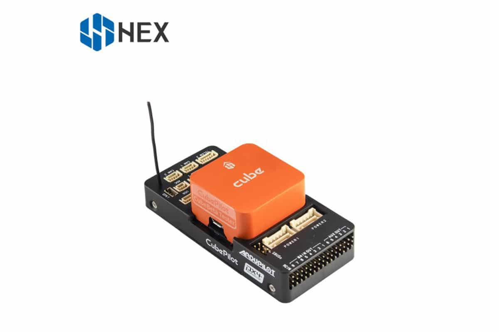

# ADS-B IN Carrier Board

The Cube Orange standard kit + ADS-B consists of the new Cube Orange Autopilot and the new ADS-B IN equipped carrier board. 

This is an updated version of the original carrier board, its overall footprint is identical to the previous versions and main changes compared to original carrier are as follows:

* Integration of uAvonix ADS-B IN Receiver
* Built-In ADS-B Antenna 
* Revmoval of Intel Edison Bay and Debug USB Ports
* New Product Livery 
* Correct labelling Of CAN Ports 

All external connections and ports remain identical to the original board apart from the following 

### uAvionix ADS-B Receiver   

The new carrier board has an integrated 1090Mhz ADS-B IN receiver from uAvionix, this allows users to detect ADS-B OUT equip aircraft in the area and displays information such as the Position, Altitude, Speed and ID of the detected aircraft on a connected ground station. This also allow sense and avoid features included in Ardupilot to be used if configured.

This ADS-B receiver is connected to the internal serial 5 Port,  this is compatible with Ardupilot, Mission Planner and QGC.This system will 

#### Configuration 

To enable ADSB in Ardupilot to detect aircraft on ground station you need to be using Copter or Plane 4.0 onward for the Cube Orange and set the following parameters 

* ADSB\_ENABLE = 1 Enable ADS-B \(Disabled as default\)
* SERIAL5\_BAUD = 57 Set baud rate
* SERIAL5\_PROTOCOL = 1 Set protocol
* SR0\_ADSB = 2 Set ADSB stream rate to ground station

**Note:**  You may need to set SR1\_ADSB = 2 to enable receiving on ground statiion on Telem 1 or SR2 for Telem 2.  

 **For Advanced users you can set the ADS-B Alarm and Sens and Avoid with the following parameters** 

* AVD\_ENABLE = 1 Enable alarm and avoidance using ADSB
* AVD\_W\_ACTION = 1 \(0=Disable, 1=Enable  \) Enable Warnings 
* AVD\_F\_ACTION = 1 Controls how the vehicle should respond to a projected near-miss \(i.e. 0= None, 1= Report, 2=Climb Or Descend, 3=Move Horizontally, 4=Move Perpendicularly in 3D, 5=RTL or 6=Hover\)
* AVD\_F\_RCVRY = 3 sets how the vehicle will behave after the vehicle has cleared the near-miss area \(i.e. 0 = Remain in EXCER\_ADSB, 1 = resume previous flight mode, 2 = RTL, 3 = Resume if AUTO else Loiter\)

More information on these settings can be found [http://ardupilot.org/plane/docs/common-ads-b-receiver.html](http://ardupilot.org/plane/docs/common-ads-b-receiver.html)

 

