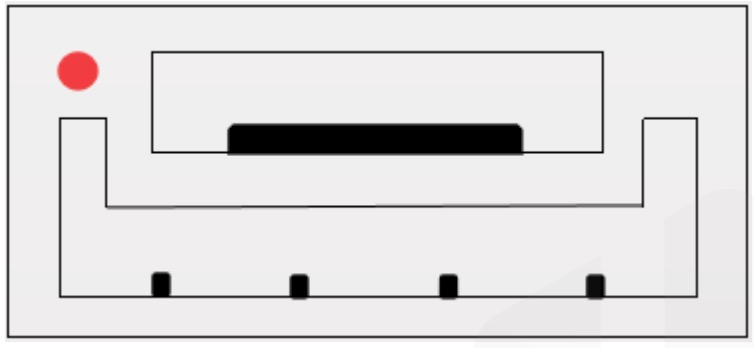
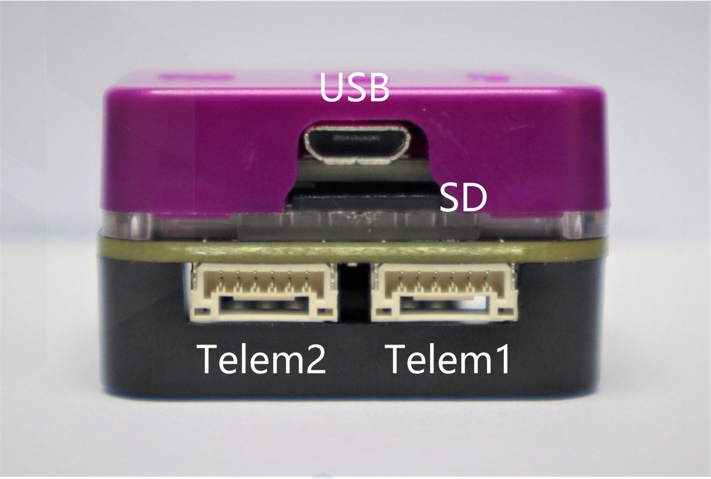
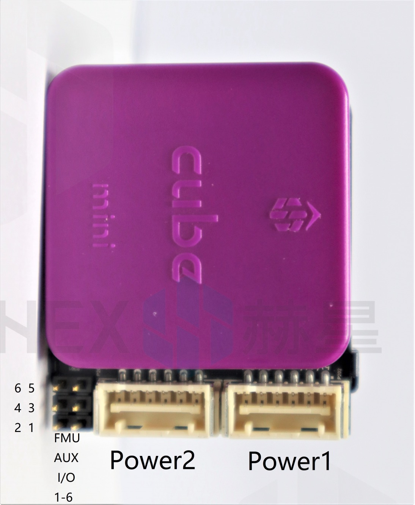
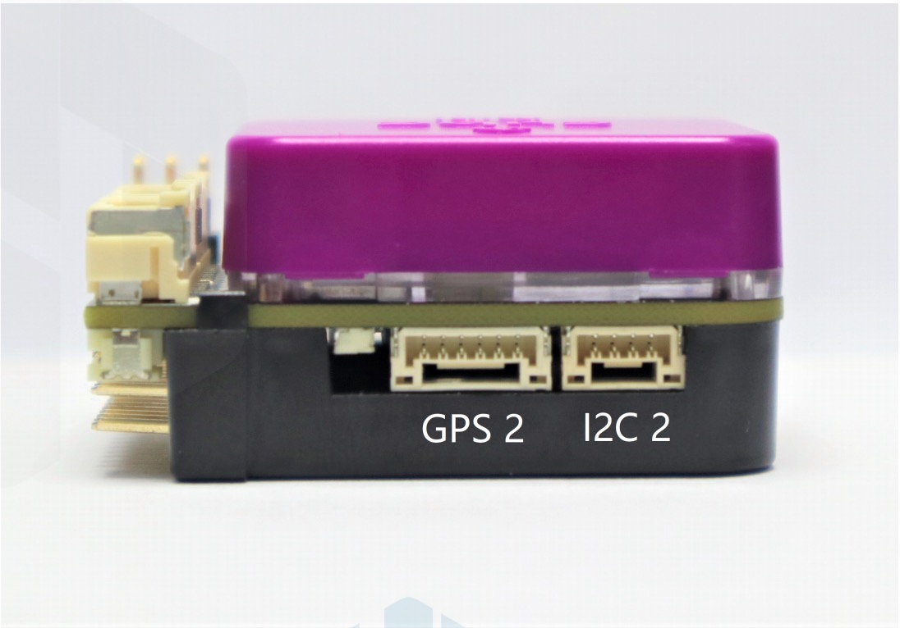

# Mini Carrier Board

### Working Conditions and Performance

| About | Description |
| :--- | :--- |
| POWER input voltage / rated input current | 4-5.7V / 2.5A; 0-20V is safe for the system but it will not work |
| POWER rated output / input power | 14 W |
| USB port input voltage / rated input current | 4-5.7V / 250mA |
| Servo rail input voltage | 4-10.5V |
| Waterproof | Not waterproof. External waterproof protection is needed |
| Working temperature | -10°C / 55°C |

### Size and Specifications

| Type | Description |
| :--- | :--- |
| Mini Carrier Board Size / Chassis Material | 47.5x38.5x17.8 \(mm\) / ABS Molding |
|  |  |

### Interfaces and Definitions

Pinout

Red dot on plug side denotes pin 1

### Mini Carrier Board Interface Model

| Ports | Corresponding Connecter Model |
| :--- | :--- |
| GPS1 | JST-GH 1.25 mm \(8-pin\) |
| GPS2 | JST-GH 1.25 mm \(6-pin\) |
| TELEM1 | JST-GH 1.25 mm \(6-pin\) |
| TELEM2 | JST-GH 1.25 mm \(6-pin\) |
| I2C | JST-GH 1.25 mm \(4-pin\) |
| CAN2 | JST-GH 1.25 mm \(4-pin\) |
| POWER1 | Molex CLIK-Mate 2 mm \(6-pin\) |
| POWER2 | Molex CLIK-Mate 2 mm \(6-pin\) |
| BUZZER | DF13 1.25 mm \(2-pin\) |

### Mini Cube 80-pin DF17 Connector Assignments \(same as the Cube Black\)

| Pin\# | Name | Direction | Description |
| :--- | :--- | :--- | :--- |
| 1 | FMU\_SWDIO | I/O | FMU serial wire debug I/O |
| 2 | FMU\_LED\_AMBER | O | Boot error LED \(drive only, controlled by FET\) |
| 3 | FMU\_SWCLK | O | FMU serial wire debug clock |
| 4 | I2C\_2\_SDA | I/O | I2C data I/O |
| 5 | EXTERN\_CS | O | Chip select for external SPI \(NC, just for debugging\) |
| 6 | I2C\_2\_SCL | O | I2C clock |
| 7 | FMU\_!RESET | I | Reset pin for the FMU |
| 8 | PROT\_SPARE\_1 |  | Spare |
| 9 | VDD\_SERVO\_IN | I | Power for last resort I/O failsafe |
| 10 | PROT\_SPARE\_2 |  | Spare |
| 11 | EXTERN\_DRDY | I | Interrupt pin for external SPI \(NC, just for debugging\) |
| 12 | SERIAL\_5\_RX | I | UART 5 RX \(Receive Data\) |
| 13 | GND |  | System GND |
| 14 | SERIAL\_5\_TX | O | UART 5 TX \(Transmit Data\) |
| 15 | GND |  | System GND |
| 16 | SERIAL\_4\_RX | I | UART 4 RX \(Receive Data\) |
| 17 | SAFETY |  | Safety button input |
| 18 | SERIAL\_4\_TX | O | UART 4 TX \(Transmit Data\) |
| 19 | VDD\_3V3\_SPEKTRUM\_EN | O | Enable for the spectrum voltage supply |
| 20 | SERIAL\_3\_RX | I | UART 3 RX \(Receive Data\) |
| 21 | PRESSURE\_SENS\_IN | AI | Analogue port, for pressure sensor, or Laser range finder, or Sonar |
| 22 | SERIAL\_3\_TX | O | UART 3 TX \(Transmit Data\) |
| 23 | AUX\_BATT\_VOLTAGE\_SENS | AI | Voltage sense for Aux battery input |
| 24 | ALARM | O | Buzzer PWM signal |
| 25 | AUX\_BATT\_CURRENT\_SENS | AI | Current sense for Aux battery input |
| 26 | IO\_VDD\_3V3 | I | IO chip power, pinned through for debugging |
| 27 | VDD\_5V\_PERIPH\_EN | O | Enable voltage supply for Peripherals |
| 28 | IO\_LED\_SAFET\_PROT | O | IO-LED\_SAFETY\(safety LED\) pinned out for IRIS |
| 29 | VBUS | I | USB VBus \(VDD\) |
| 30 | SERIAL\_2\_RTS |  | UART 2 RTS \(Request To Send\) |
| 31 | OTG\_DP1 | I/O | USB Data+ |
| 32 | SERIAL\_2\_CTS |  | UART 2 CTS \(Clear To Send\) |
| 33 | OTG\_DM1 | I/O | USB Data- |
| 34 | SERIAL\_2\_RX | I | UART 2 RX \(Receive Data\) |
| 35 | I2C\_1\_SDA | I/O | I2C data I/O |
| 36 | SERIAL\_2\_TX | O | UART 2 TX \(Transmit Data\) |
| 37 | I2C\_1\_SCL | O | I2C clock |
| 38 | SERIAL\_1\_RX | I | UART 1 RX \(Receive Data\) |
| 39 | CAN\_L\_2 | I/O | FMU CAN bus Low signal driver |
| 40 | SERIAL\_1\_TX | O | UART 1 TX \(Transmit Data\) |
| 41 | CAN\_H\_2 | I/O | FMU CAN bus High signal driver |
| 42 | SERIAL\_1\_RTS |  | UART 1 RTS \(Request To Send\) |
| 43 | VDD\_5V\_PERIPH\_OC | I | Error state message from peripheral power supply |
| 44 | SERIAL\_1\_CTS |  | UART 1 CTS \(Clear To Send\) |
| 45 | VDD\_5V\_HIPOWER\_OC | I | Error state message from High power peripheral power supply |
| 46 | IO\_USART\_1\_TX | O | I/O USART 1 TX |
| 47 | BATT\_VOLTAGE\_SENS\_PROT | AI | Voltage sense from main battery |
| 48 | IO\_USART1\_RX\_SPECTRUM\_DSM | O | Signal from Spectrum receiver |
| 49 | BATT\_CURRENT\_SENS\_PROT | AI | Current sense from main battery |
| 50 | FMU\_CH1\_PROT | O | FMU PWM output channel 1 |

### !! KEEP UPDATING !!

