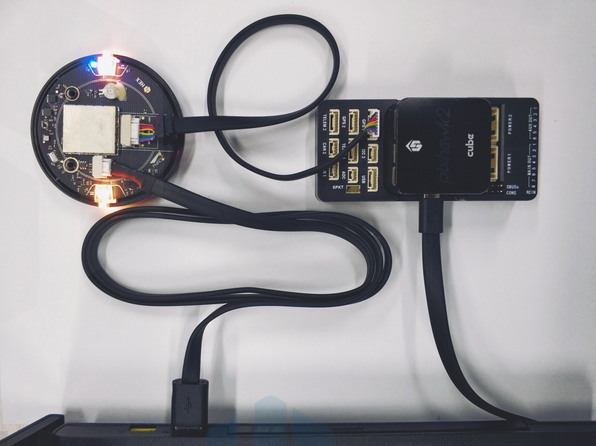
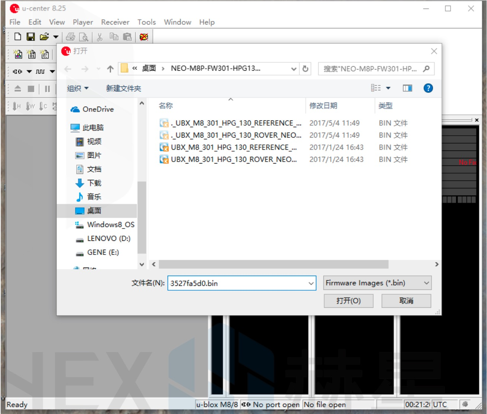
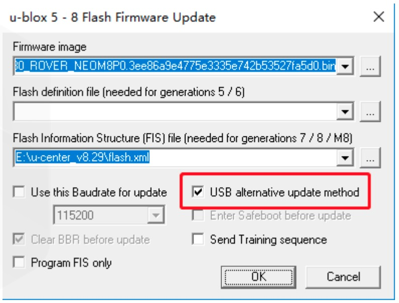
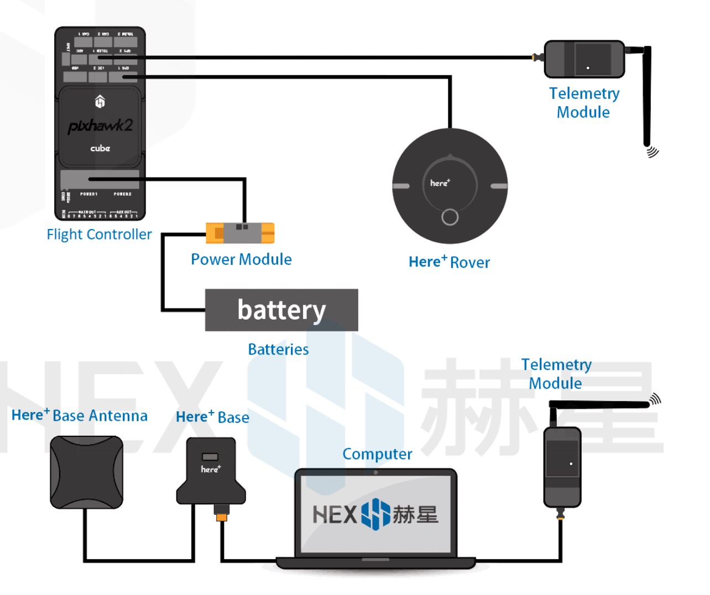
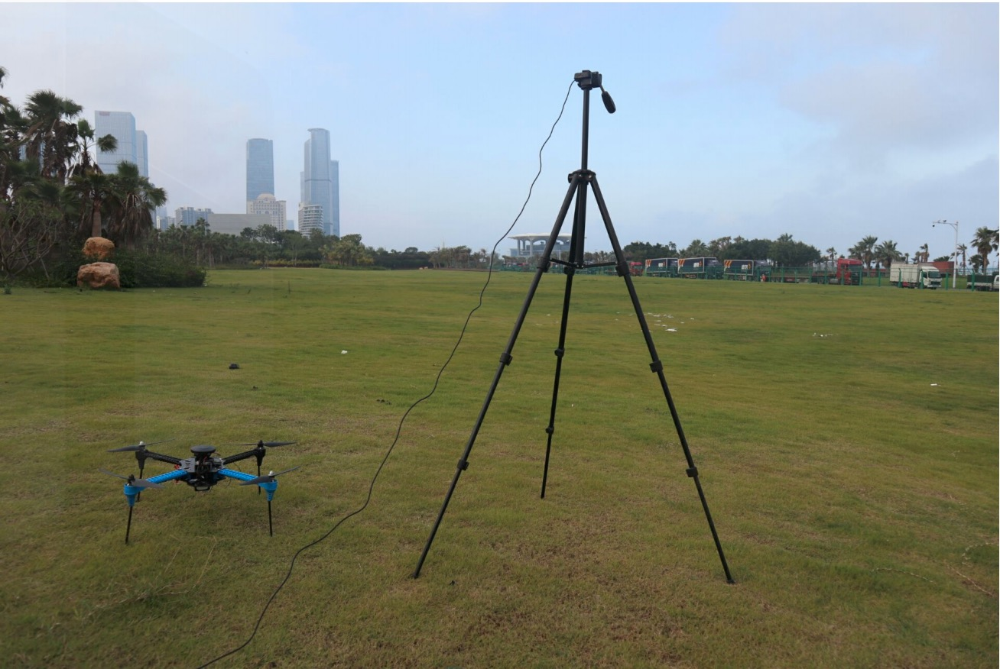
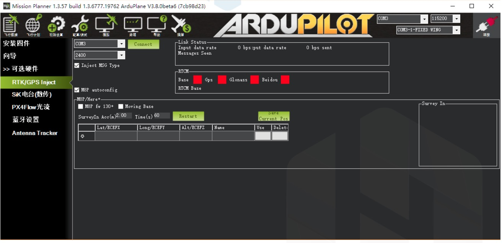
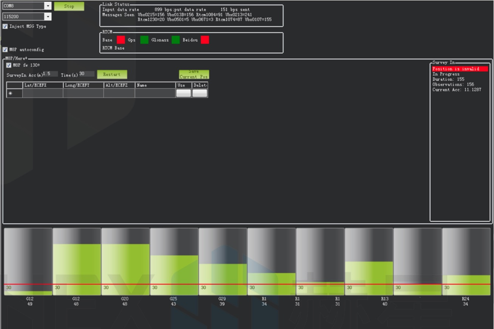

# Here+V2 User Manual

### Overview

HERE+/HERE+ V2 RTK kit developed by HEX and Ardupilot Team is compatible with Mission Planner, a ground control station for ArduPilot, as well as PX4 and QGroundControl. The kit is the first Differential Global Positioning System \(DGPS\) module for open source flight controller users. 

RTK technology provides much more accurate position estimates than regular GNSS systems. Its ideal accuracy can reach up to centimeters, which greatly improve the precision of flight. 

Being the first RTK positioning system developed for open source community, HERE+ is easy to use. The Here+ GPS kit comes with a base and a rover. The base can work with Mission Planner with minimum setup required. The data communication between rover and base modules is through a pair of telemetry module\(not provided in the standard Here+ package\). 

HERE+/HERE+ V2 has a full set of Inertial navigation system \(gyroscope, accelerometer, compass and barometer\) and GNSS data to acquire more accurate navigation. In the Ardupilot and PX4 firmware, RTK positioning data is fused with build-in Extended Kalman filter \(EKF\) algorithm for optimized positioning result.

### High Precision Positioning:

Many applications of UAV need better precision than what regular GNSS can provide. For example: UAV surveying and mapping; agriculture measuring; high precision take-off and landing; UAV swarming; etc.

RTK Differential GPS that is compatible with open source flight controllers THE CUBE、pixhawk、APM.

-Support 1 Base to Multiple Rovers   
-Light and Power Efficient RTK Real-time DGPS Solution   
-Centimeters Level Positioning and Navigation

By Real-time kinematic technology, HERE+ provides real-time 3D coordinate of the observing point. Transmitting carrier phase measurement of the base to rover for correction. Comparing carrier phase from GPS and base respectively, the module calculate the phase difference to obtain centimeters level positioning in real-time.

### The Standard Here+ Kit Includes:

#### HERE+ V1

| Item | Number |
| :--- | :--- |
| here+ RTK Rover | x1 |
| here+ RTK Rover Connecting Cable | x1 |
| here+ RTK Base Base | x1 |
| here+ RTK Base Base USB Cable | x1 |

#### HERE+ V2

| Item | Number |
| :--- | :--- |
| here+ v2 RTK Rover | x1 |
| here+ RTK Rover Connecting Cable \(serial + I2C\) | x1 |
| here+ RTK Rover Connecting Cable \(CAN\) | x1 |
| UART-USB Converter for Upgrading Rover | x1 |
| here+ RTK Base Base | x1 |
| here+ RTK Base Base USB Cable | x1 |

### Antenna Placing

#### Placing the RTK Antenna is very important for getting precise RTK positioning

For the working condition of RTK, there are some special requirements that are more demanding than regular GPS.

The best environment requires the base and rover antenna to have clear view of the sky that is 30 degrees above horizon. RTK antenna can be elevated but make sure that there are no obstacles around, such as buildings, trees, cars, and etc.

**Example of bad environment**: indoors, urban area, forest, near the ground.

**Example of good environment**: Open spaces, peak of the mountains, roof of the buildings.

Do not place the antenna near electronic devices, as high power electronic devices nearby may affect the radio frequency noise of GPS signal. Examples are mobile phone base stations, high voltage transformers, and etc.

### Hardware Specification

#### HERE+ Rover Hardware Parameters

<table>
  <thead>
    <tr>
      <th style="text-align:left">GNSS module</th>
      <th style="text-align:left">Connector</th>
    </tr>
  </thead>
  <tbody>
    <tr>
      <td style="text-align:left">u-blox NEO-M8P-0</td>
      <td style="text-align:left">
        
HERE+ V1: USB, UART (JST-GH connector)

        
HERE+ V2: UART (JST-GH connector)

      </td>
    </tr>
  </tbody>
</table>#### Sensors

| IMU | Compass | Barometer |
| :--- | :--- | :--- |
| MPU9250/ICM20948 | HMC5983/ICM20948 | MS5611 |

#### HERE+ Base Hardware Parameters

| GNSS module | Ceramic antenna | Connector |
| :--- | :--- | :--- |
| u-blox NEO-M8P-2 | CGGBP.25.4.A.02 | USB, UART, SMA |

| GNSS Signals Supported | Working Environment | Working Voltage | Working Temperature |
| :--- | :--- | :--- | :--- |
| GPS L1 C/A，GLONASS L10F， BeiDou B11 | Height 5000m，Velocity 500m/s | 5V | -40℃ to 85℃ |

#### Time-To-First-Fix

|  | GPS & GLONASS | GPS & BeiDou | GPS |
| :--- | :--- | :--- | :--- |
| Cold Start | 26S | 28S | 29S |
| Hot Start | 1S | 1S | 1S |
| Aided Starts | 2S | 3S | 2S |

#### Sensitivity

|  | GPS & GLONASS | GPS & BeiDou | GPS |
| :--- | :--- | :--- | :--- |
| Tracking & Navigation | -160dBm | -160dBm | -160dBm |
| Reacquisition | -160dBm | -160dBm | -160dBm |
| Cold Start | -140dBm | -148dBm | -148dBm |
| Hot Start | -157dBm | -157dBm | -157dBm |

#### Maximum Navigation update rate for RTK

| GPS & GLONASS | GPS& BeiDou | GPS |
| :--- | :--- | :--- |
| 5Hz | 5Hz | 8Hz |

| Antenna Supported | Horizontal position accuracy |
| :--- | :--- |
| Active and Passive Antenna | RTK 0.025m+1ppm CEP |

|  | Size | Weight |
| :--- | :--- | :--- |
| HERE+ Rover | 49mmx49mmx17mm | 49g |
| HERE+ Base | 40mmx41mmx11mm | 18.6g |

#### Safety Switch

Enable/disable motors and servos output Long press safety switch for 3 seconds until LED turns solid. Motors and servos can then be turned on. 

LED meanings：   
Continuously Flashing - System Initializing Intermittent Flashing – System ready. Press to enable motor output 

Enable/Disable safety switch：   
Connect flight controller to Mission Planner and go to "Full Parameter List" under "Configuration

### Here+ /Here+ v2 LED Meaning

**Flashing red and blue**：Initializing sensors. Place the vehicle still and level while it initializes the sensors.   
**Flashing blue**：Disarmed, no GPS lock. Auto-mission, loiter and return-to-launch flight modes require GPS lock   
**Solid blue**：Armed with no GPS lock   
**Flashing green**：Disarmed \(ready to arm\), GPS lock acquired. Quick double tone when disarming from the armed state.   
**Fast Flashing green**: Same as above but GPS is using SBAS \(so should have better position estimate\)   
**Solid green**: with single long tone at time of arming: Armed, GPS lock acquired. Ready to fly!   
**Double flashing yellow**: Failing pre-arm checks \(system refuses to arm\)   
**Single Flashing yellow**: Radio failsafe activated

**Flashing yellow - with quick beeping tone**: Battery failsafe activated   
**Flashing yellow and blue- with high-high-high-low tone sequence \(dah-dah-dah-doh\)**: GPS glitch or GPS failsafe activated   
**Flashing red and yellow**：EKF or Inertial Nav failure   
**Flashing purple and yellow**: Barometer glitch Solid Red: Error，usually due to the SD card（re-plug or place the SD card to solve）,MTD or IMU，you may check the SD card and have a look at BOOT.txt for boot message analysis   
**Solid red with SOS tone sequence**：SD card missing or SD card bad format   
**No light when power on** : No firmware，firmware lost，SD card missing or bad format（ac3.4 or higher version）

### Firmware Update

Check your current firmware version before update Check Current Base/Rover Firmware Version

The default firmware version of the HERE + modules is ublox-1.10 firmware. The new version of 1.30 firmware includes new feature of fusing other satellite systems \(Glonass / Beidou\) with GPS for RTK operations, effectively increasing the RTK positioning accuracy. Therefore, it is recommended that all users upgrade to 1.30 firmware before using HERE+. During the preparation of this guide, ublox-1.40 version of the firmware has also been released. 1.40 version firmware introduced a new feature called the mobile base station, that is, the base station need not be fixed in a location. For example, a base station may be placed on a moving vehicle or boat. Upgrading to Ublox-1.40 version is similar to upgrading to 1.30. For users who do not need to use the mobile baseline feature, upgrading to version 1.30 is sufficient.

### Downloading U-centre UI and 1.30 Firmware

Upgrading firmware requires the use of Ublox’s Windows software U-center. To download U-center, please go to the [official website](https://www.u-blox.com/en/product/u-center)

Then follow the prompts to install U-cent software. During the installation process, you will be prompted to install the device Driver, please ensure that only the Standard Driver For Windows is checked, as shown below.（at the newer updates, there will be only 1 selectable driver）

#### **Get Firmware**

You will also need to download firmware here Click the choice: u-blox M8 Flash Firmware 3.01 HPG 1.30

* ONLY for High Precision GNSS products.

#### Connect your HERE+ Base and Rover to Computer

When upgrading the **base** station module, use the USB cable to connect the base station module to the computer USB interface, as shown in the following photo:

When upgrading a **Here+ V1 rover** module \(for **Here+ V2** upgrade, please refer to the later section\), use a hexagonal screwdriver to open the case. The rover module has a USB interface connector identical to the base module, you can use the base module USB cable to connect rover to computer. In addition, during the firmware upgrading process, the rover module needs to be powered by connecting to flight controller, as shown in the following photo:

#### Upgrading Process

Open the U-center software, click the connection button \(as shown in the red circle\), select the com port that corresponds to your base/ rover module. Please be reminded that the port should not be connected to other software otherwise the port will be occupied and unavailable.

Click "tools →u-blox 5 – 8 Flash Firmware Update and click the settings as shown below:   
In the higher versions, "u-blox 5 – 8 Flash Firmware Update" has been changed to "legacy firmware update", please operate according to the software version.

In Firmware image, unzip and select the downloaded 1.30 Firmware.

**For base module, chose the firmware with title:** UBX\_M8\_301\_HPG\_130\_REFERENCE\_NEOM8P2.59a07babb501ba6a89ff87cac2f 2765f.bin

**For rover module, choose the firmware:** UBX\_M8\_301\_HPG\_130\_ROVER\_NEOM8P0.3ee86a9e4775e3335e742b53527fa5 d0.bin

In Flash Information Structure\(FIS\) File, select Flash.xml，which is located in the installation address of Ucentre software \(U-center\_v8.25→flash.xml\).

Click "OK" and wait for the firmware uploading to complete. For Here+ V1, uploading usually takes only a minute or less. Here+ V2 will take longer time. If the uploading is successful, the upgrade interface is displayed in green; if the upgrade is aborted, the interface is displayed in red. If the process is interrupted, or if it is not responding for a long time, the modules will need to be power cycled and uploading needs to be done again.

#### Check Current Rover/Base Firmware Version

When base/rover is already connected to U-center, click View, go to "View→Message View→ UBX → MON → VER". You will see the interface below:

As shown in the figure, the current firmware version is FWVER = HPG 1.30 REF, indicating that the current firmware version is 1.30 for base module.

#### Here+ V2 Firmware Update

**Preparation**

| Tools |  |
| :--- | :--- |
| UART-USB converter |  |
| Cables |  |
| Hexagonal screw driver |  |

Connect the cable with UART-USB converter. Connect the red wire to 5V pin and black wire to GND pin.

Remove the cover of Here+ v2 with hexagonal screw driver \(You have to press and hold to remove the buckle\). Then replace the cable.

Plug the connector to the computer USB port. Check if all drivers are ready in device manager. If not, drivers can be downloaded here: [link to download connector driver ](http://winchiphead.com/download/CH341/CH341SER.ZIP)

The correct driver should be "USB-SERIAL CH340\(COM\#\)"   
"\#" is the corresponding port number.

Open u-center and select the COM port for connector. Set the baud rate to 9600 then connect.

After connection, select "Tools&gt;legacy firmware update" to enter firmware update UI. Check the option "USB alternative update method" and select the firmware to be updated. \(firmware for here+ and here2+ are the same, please look for detailed procedures from the here+ update procedure\). Click OK to begin update.

Wait for the progress bar to finish. If the window turns green, update is successful.

If connection failed after the update window shows up, please change the baud rate to 115200 then update it twice \(it maybe still failed at the first retry so please retry it twice\).

### Basic Operating Manual

These instructions focus on the setup using Mission Planner on Windows, but HERE+ is also supported by QGroundControl.

#### Base/Rover Survey by Mission Planner

This part of the tutorial uses Mission Planner ground control software and Arducopter-3.5 flight control firmware for operating instructions. If you are using QGroundControl and PX4 firmware, please read:https:// docs.px4.io/en/advanced\_features/rtk-gps.html

#### Preparation before operation

To use HERE+ on a UAV, you need the following hardware： Computer, telemetry modules, here+ rover module, here+ Base Antenna, here+ Base, Tripod\(Stand\)

Before using, make sure the hardware are connected correctly：   
**Ground side:** The base station module is connected to the computer port through USB port; a telemetry module is connected to another USB port of the same computer.   
**UAV side:** HERE + rover module is connected to the flight controller GPS connector; telemetry module is connected to the TELEM interface.

Please place the base station in an outdoor environment with sufficient sky coverage to obtain a good satellite signal. Place the base station on a stable and elevated platform, such as a tripod.

**Base Module Setting using Mission Planner**

Start with base module setup first. During the base station setup, the rover and the UAV do not need to be turned on. 

Open the Mission Planner ground station software on your computer and go to the "initial setup → Optional Hardware → RTK/GPS Inject". You will see the following page:

Select the correct base module com port in the top left corner and click connect. In the SurveyIn Acc section, enter the absolute geographic accuracy that you expect your HERE + base station to achieve. In the Time column, enter the minimum survey time you expect. Click on Restart, the ground station will transfer the data you have entered to the HERE + base module, the base module will start a new round of surveying. You will see the following page:

During the survey process, the right box will show the current survey status: **Position is invalid:** base station has not yet reached a valid location;   
**In Progress:** survey is still in progress；   
**Duration:** The number of seconds that the current surveying task has been executed;   
**Observation:** the number of observations acquired;   
**Current Acc:** Absolute geographic accuracy that the current base station can achieve;   
**Green bar** at the lower part of the Mission Planner page shows the satellites being detected and the signal strength related to each satellite.

The base station needs a certain amount of time to meet the accuracy requirements of your input. Testing shows that, in an open area without shelter, to achieve the absolute accuracy of 2m takes a few minutes; to reach the absolute accuracy of less than 30cm takes around an hour; to reach the accuracy of 10cm takes a few hours.

It should be noted that the absolute geographic accuracy of the base station here will affect the absolute geographic accuracy of the rover module without affecting the relative accuracy between the base station and rover. If your application does not require UAV with high absolute geographic accuracy, you do not need to set the base station’s precision too high, resulting in long survey time.

Even if the accuracy of the base station is 1.5 to 2 m, the position accuracy of the rover module relative to the base station can still reach centimeter level.

After the survey is complete, Mission Planner will display the following page:

In the RTCM box it shows that the base status indicator is green and both the GPS and Glonass satellite systems are green \(if you want to change the satellite system, refer to the following section\). The box on the right says "Position is valid".

To store the current location in the Mission Planner: Click "Save Current Pos", enter a name in the dialog box, and click "OK". As shown below, you can see your saved location in the list. Click the "Use" button for the location you saved. The base station will enter the fixed mode and the status will show "Using FixedLLA". In the future, if you set the base station in the same location, you do not need to conduct survey again, just click the "Use" button that corresponds to the location you have saved.

**!!Updating in progress!!**

