# Here+V2 User Manual

## Overview

HERE+/HERE+ V2 RTK kit developed by HEX and Ardupilot Team is compatible with Mission Planner, a ground control station for ArduPilot, as well as PX4 and QGroundControl. The kit is the first Differential Global Positioning System \(DGPS\) module for open source flight controller users.

RTK technology provides much more accurate position estimates than regular GNSS systems. Its ideal accuracy can reach up to centimeters, which greatly improve the precision of flight.

Being the first RTK positioning system developed for open source community, HERE+ is easy to use. The Here+ GPS kit comes with a base and a rover. The base can work with Mission Planner with minimum setup required. The data communication between rover and base modules is through a pair of telemetry module\(not provided in the standard Here+ package\).

HERE+/HERE+ V2 has a full set of Inertial navigation system \(gyroscope, accelerometer, compass and barometer\) and GNSS data to acquire more accurate navigation. In the Ardupilot and PX4 firmware, RTK positioning data is fused with build-in Extended Kalman filter \(EKF\) algorithm for optimized positioning result.

## High Precision Positioning:

Many applications of UAV need better precision than what regular GNSS can provide. For example: UAV surveying and mapping; agriculture measuring; high precision take-off and landing; UAV swarming; etc.

RTK Differential GPS that is compatible with open source flight controllers THE CUBE、pixhawk、APM.

-Support 1 Base to Multiple Rovers  
-Light and Power Efficient RTK Real-time DGPS Solution  
-Centimeters Level Positioning and Navigation

By Real-time kinematic technology, HERE+ provides real-time 3D coordinate of the observing point. Transmitting carrier phase measurement of the base to rover for correction. Comparing carrier phase from GPS and base respectively, the module calculate the phase difference to obtain centimeters level positioning in real-time.

## The Standard Here+ Kit Includes:

### HERE+ V1

| Item | Number |
| :--- | :--- |
| here+ RTK Rover | x1 |
| here+ RTK Rover Connecting Cable | x1 |
| here+ RTK Base Base | x1 |
| here+ RTK Base Base USB Cable | x1 |

### HERE+ V2

| Item | Number |
| :--- | :--- |
| here+ v2 RTK Rover | x1 |
| here+ RTK Rover Connecting Cable \(serial + I2C\) | x1 |
| here+ RTK Rover Connecting Cable \(CAN\) | x1 |
| UART-USB Converter for Upgrading Rover | x1 |
| here+ RTK Base Base | x1 |
| here+ RTK Base Base USB Cable | x1 |

## Antenna Placing

### Placing the RTK Antenna is very important for getting precise RTK positioning

For the working condition of RTK, there are some special requirements that are more demanding than regular GPS.

The best environment requires the base and rover antenna to have clear view of the sky that is 30 degrees above horizon. RTK antenna can be elevated but make sure that there are no obstacles around, such as buildings, trees, cars, and etc.

**Example of bad environment**: indoors, urban area, forest, near the ground.

**Example of good environment**: Open spaces, peak of the mountains, roof of the buildings.

Do not place the antenna near electronic devices, as high power electronic devices nearby may affect the radio frequency noise of GPS signal. Examples are mobile phone base stations, high voltage transformers, and etc.

## Hardware Specification

### HERE+ Rover Hardware Parameters

| GNSS module | Connector |
| :--- | :--- |

<table>
  <thead>
    <tr>
      <th style="text-align:left">u-blox NEO-M8P-0</th>
      <th style="text-align:left">
        
HERE+ V1: USB, UART (JST-GH connector)

        
HERE+ V2: UART (JST-GH connector)

      </th>
    </tr>
  </thead>
  <tbody></tbody>
</table>| IMU | Compass | Barometer |
| :--- | :--- | :--- |
| MPU9250/ICM20948 | HMC5983/ICM20948 | MS5611 |

### HERE+ Base Hardware Parameters

| GNSS module | Ceramic antenna | Connector |
| :--- | :--- | :--- |
| u-blox NEO-M8P-2 | CGGBP.25.4.A.02 | USB, UART, SMA |

| GNSS Signals Supported | Working Environment | Working Voltage | Working Temperature |
| :--- | :--- | :--- | :--- |
| GPS L1 C/A，GLONASS L10F， BeiDou B11 | Height 5000m，Velocity 500m/s | 5V | -40℃ to 85℃ |

### Time-To-First-Fix

|  | GPS & GLONASS | GPS & BeiDou | GPS |
| :--- | :--- | :--- | :--- |
| Cold Start | 26S | 28S | 29S |
| Hot Start | 1S | 1S | 1S |
| Aided Starts | 2S | 3S | 2S |

### Sensitivity

|  | GPS & GLONASS | GPS & BeiDou | GPS |
| :--- | :--- | :--- | :--- |
| Tracking & Navigation | -160dBm | -160dBm | -160dBm |
| Reacquisition | -160dBm | -160dBm | -160dBm |
| Cold Start | -140dBm | -148dBm | -148dBm |
| Hot Start | -157dBm | -157dBm | -157dBm |

### Maximum Navigation update rate for RTK

| GPS & GLONASS | GPS& BeiDou | GPS |
| :--- | :--- | :--- |
| 5Hz | 5Hz | 8Hz |

| Antenna Supported | Horizontal position accuracy |
| :--- | :--- |
| Active and Passive Antenna | RTK 0.025m+1ppm CEP |

|  | Size | Weight |
| :--- | :--- | :--- |
| HERE+ Rover | 49mmx49mmx17mm | 49g |
| HERE+ Base | 40mmx41mmx11mm | 18.6g |

### Safety Switch

Enable/disable motors and servos output Long press safety switch for 3 seconds until LED turns solid. Motors and servos can then be turned on.

LED meanings：  
Continuously Flashing - System Initializing Intermittent Flashing – System ready. Press to enable motor output

Enable/Disable safety switch：  
Connect flight controller to Mission Planner and go to "Full Parameter List" under "Configuration

## Here+ /Here+ v2 LED Meaning

**Flashing red and blue**：Initializing sensors. Place the vehicle still and level while it initializes the sensors.  
**Flashing blue**：Disarmed, no GPS lock. Auto-mission, loiter and return-to-launch flight modes require GPS lock  
**Solid blue**：Armed with no GPS lock  
**Flashing green**：Disarmed \(ready to arm\), GPS lock acquired. Quick double tone when disarming from the armed state.  
**Fast Flashing green**: Same as above but GPS is using SBAS \(so should have better position estimate\)  
**Solid green**: with single long tone at time of arming: Armed, GPS lock acquired. Ready to fly!  
**Double flashing yellow**: Failing pre-arm checks \(system refuses to arm\)  
**Single Flashing yellow**: Radio failsafe activated

**Flashing yellow - with quick beeping tone**: Battery failsafe activated  
**Flashing yellow and blue- with high-high-high-low tone sequence \(dah-dah-dah-doh\)**: GPS glitch or GPS failsafe activated  
**Flashing red and yellow**：EKF or Inertial Nav failure  
**Flashing purple and yellow**: Barometer glitch Solid Red: Error，usually due to the SD card（re-plug or place the SD card to solve）,MTD or IMU，you may check the SD card and have a look at BOOT.txt for boot message analysis  
**Solid red with SOS tone sequence**：SD card missing or SD card bad format  
**No light when power on** : No firmware，firmware lost，SD card missing or bad format（ac3.4 or higher version）

## Firmware Update

Check your current firmware version before update Check Current Base/Rover Firmware Version

The default firmware version of the HERE + modules is ublox-1.10 firmware. The new version of 1.30 firmware includes new feature of fusing other satellite systems \(Glonass / Beidou\) with GPS for RTK operations, effectively increasing the RTK positioning accuracy. Therefore, it is recommended that all users upgrade to 1.30 firmware before using HERE+. During the preparation of this guide, ublox-1.40 version of the firmware has also been released. 1.40 version firmware introduced a new feature called the mobile base station, that is, the base station need not be fixed in a location. For example, a base station may be placed on a moving vehicle or boat. Upgrading to Ublox-1.40 version is similar to upgrading to 1.30. For users who do not need to use the mobile baseline feature, upgrading to version 1.30 is sufficient.

## Downloading U-centre UI and 1.30 Firmware

Upgrading firmware requires the use of Ublox’s Windows software U-center. To download U-center, please go to the [official website](https://www.u-blox.com/en/product/u-center)

Then follow the prompts to install U-cent software. During the installation process, you will be prompted to install the device Driver, please ensure that only the Standard Driver For Windows is checked, as shown below.（at the newer updates, there will be only 1 selectable driver）

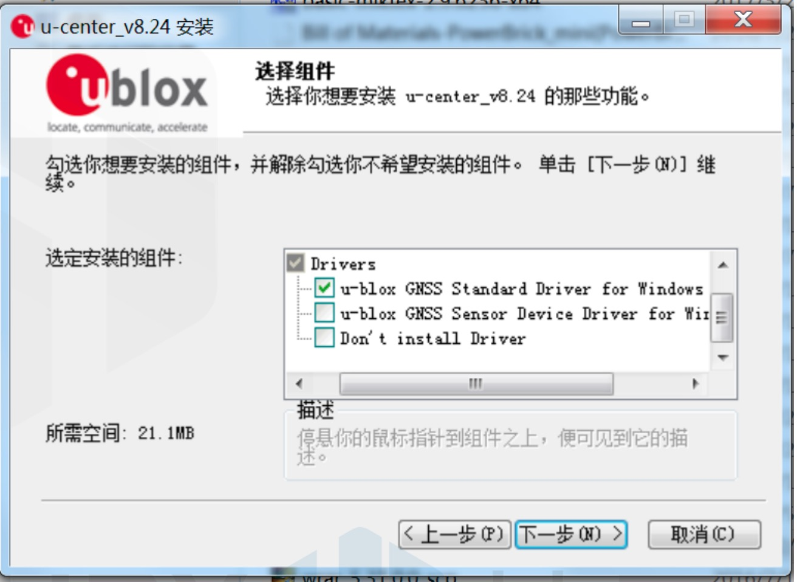

### **Get Firmware**

You will also need to download firmware here Click the choice: u-blox M8 Flash Firmware 3.01 HPG 1.30

* ONLY for High Precision GNSS products.

### Connect your HERE+ Base and Rover to Computer

When upgrading the **base** station module, use the USB cable to connect the base station module to the computer USB interface, as shown in the following photo:

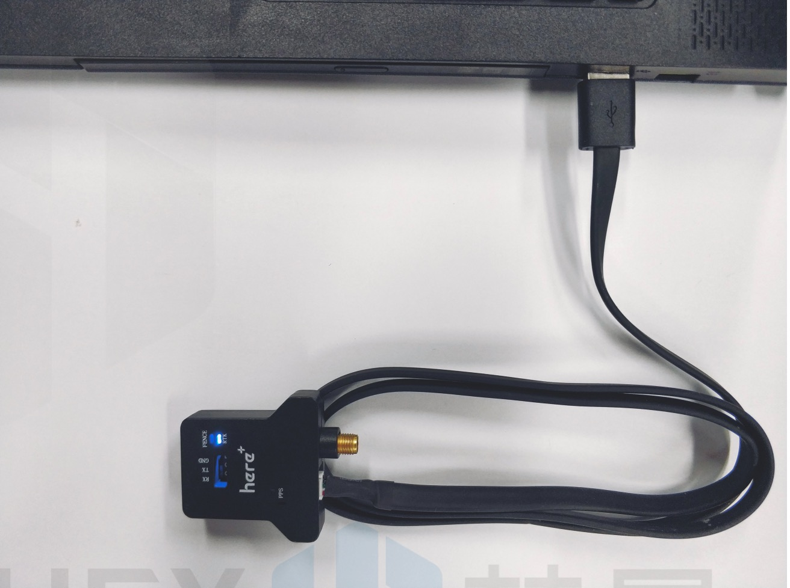

When upgrading a **Here+ V1 rover** module \(for **Here+ V2** upgrade, please refer to the later section\), use a hexagonal screwdriver to open the case. The rover module has a USB interface connector identical to the base module, you can use the base module USB cable to connect rover to computer. In addition, during the firmware upgrading process, the rover module needs to be powered by connecting to flight controller, as shown in the following photo:

### Upgrading Process

Open the U-center software, click the connection button \(as shown in the red circle\), select the com port that corresponds to your base/ rover module. Please be reminded that the port should not be connected to other software otherwise the port will be occupied and unavailable.

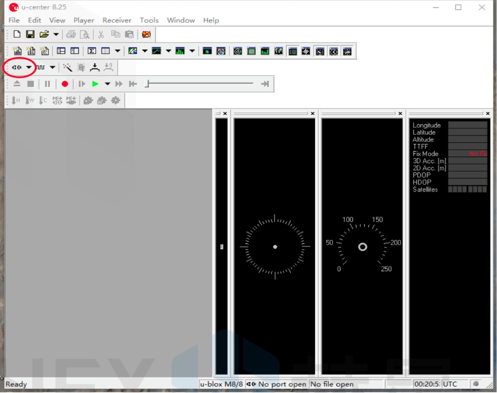

Click "tools →u-blox 5 – 8 Flash Firmware Update and click the settings as shown below:  
In the higher versions, "u-blox 5 – 8 Flash Firmware Update" has been changed to "legacy firmware update", please operate according to the software version.

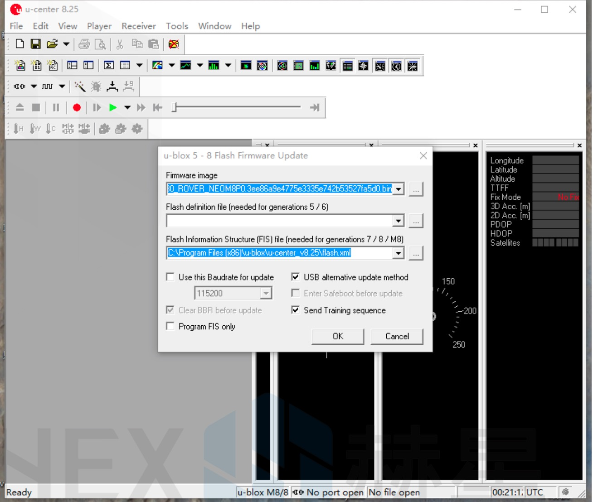

In Firmware image, unzip and select the downloaded 1.30 Firmware.

**For base module, chose the firmware with title:** UBX\_M8\_301\_HPG\_130\_REFERENCE\_NEOM8P2.59a07babb501ba6a89ff87cac2f 2765f.bin

**For rover module, choose the firmware:** UBX\_M8\_301\_HPG\_130\_ROVER\_NEOM8P0.3ee86a9e4775e3335e742b53527fa5 d0.bin

In Flash Information Structure\(FIS\) File, select Flash.xml，which is located in the installation address of Ucentre software \(U-center\_v8.25→flash.xml\).

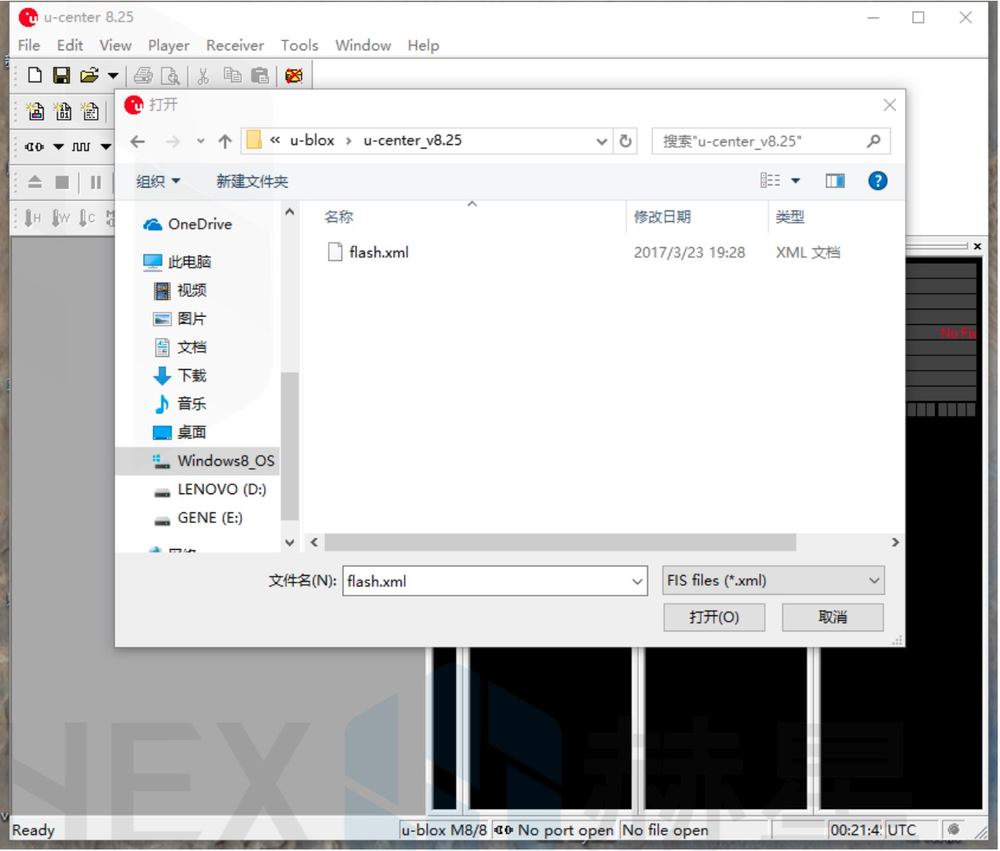

Click "OK" and wait for the firmware uploading to complete. For Here+ V1, uploading usually takes only a minute or less. Here+ V2 will take longer time. If the uploading is successful, the upgrade interface is displayed in green; if the upgrade is aborted, the interface is displayed in red. If the process is interrupted, or if it is not responding for a long time, the modules will need to be power cycled and uploading needs to be done again.

### Check Current Rover/Base Firmware Version

When base/rover is already connected to U-center, click View, go to "View→Message View→ UBX → MON → VER". You will see the interface below:

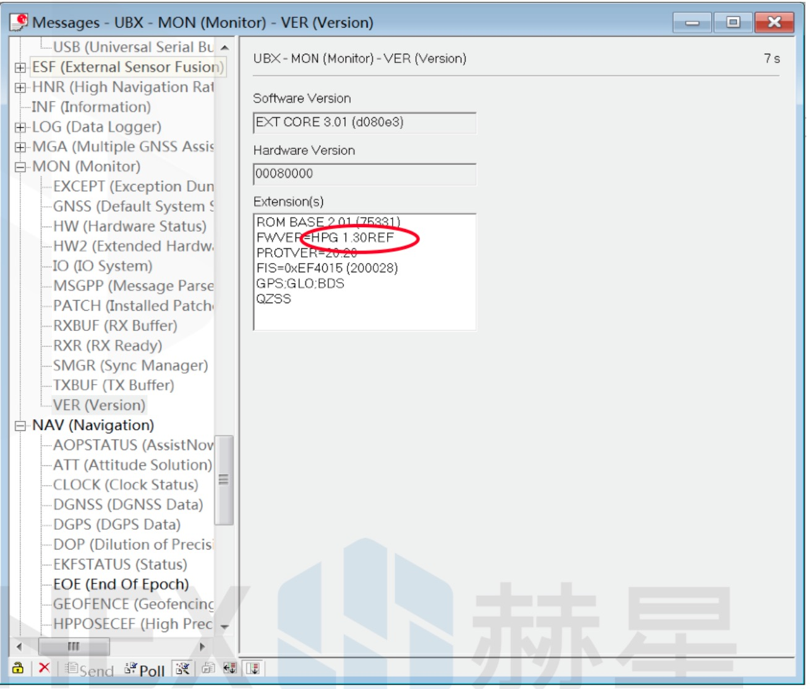

As shown in the figure, the current firmware version is FWVER = HPG 1.30 REF, indicating that the current firmware version is 1.30 for base module.

### Here+ V2 Firmware Update

**Preparation**

| Tools |  |
| :--- | :--- |
| UART-USB converter |  |
| Cables |  |
| Hexagonal screw driver |  |

Connect the cable with UART-USB converter. Connect the red wire to 5V pin and black wire to GND pin.

Remove the cover of Here+ v2 with hexagonal screw driver \(You have to press and hold to remove the buckle\). Then replace the cable.

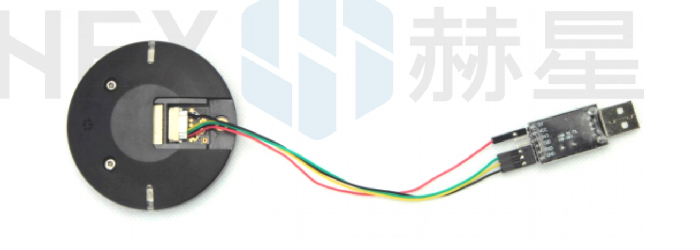

Plug the connector to the computer USB port. Check if all drivers are ready in device manager. If not, drivers can be downloaded here: [link to download connector driver ](http://winchiphead.com/download/CH341/CH341SER.ZIP)

The correct driver should be "USB-SERIAL CH340\(COM\#\)"  
"\#" is the corresponding port number.

Open u-center and select the COM port for connector. Set the baud rate to 9600 then connect.

After connection, select "Tools&gt;legacy firmware update" to enter firmware update UI. Check the option "USB alternative update method" and select the firmware to be updated. \(firmware for here+ and here2+ are the same, please look for detailed procedures from the here+ update procedure\). Click OK to begin update.

Wait for the progress bar to finish. If the window turns green, update is successful.

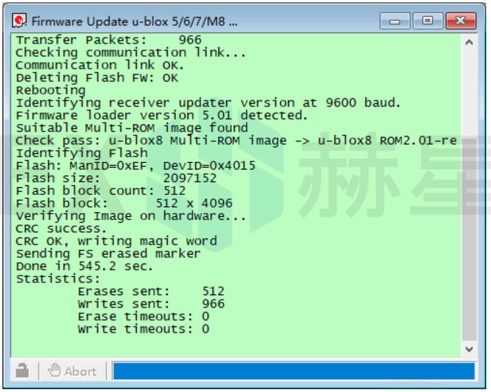

If connection failed after the update window shows up, please change the baud rate to 115200 then update it twice \(it maybe still failed at the first retry so please retry it twice\).

## Basic Operating Manual

These instructions focus on the setup using Mission Planner on Windows, but HERE+ is also supported by QGroundControl.

### Base/Rover Survey by Mission Planner

This part of the tutorial uses Mission Planner ground control software and Arducopter-3.5 flight control firmware for operating instructions. If you are using QGroundControl and PX4 firmware, please read:https:// docs.px4.io/en/advanced\_features/rtk-gps.html

### Preparation before operation

To use HERE+ on a UAV, you need the following hardware： Computer, telemetry modules, here+ rover module, here+ Base Antenna, here+ Base, Tripod\(Stand\)

Before using, make sure the hardware are connected correctly：  
**Ground side:** The base station module is connected to the computer port through USB port; a telemetry module is connected to another USB port of the same computer.  
**UAV side:** HERE + rover module is connected to the flight controller GPS connector; telemetry module is connected to the TELEM interface.

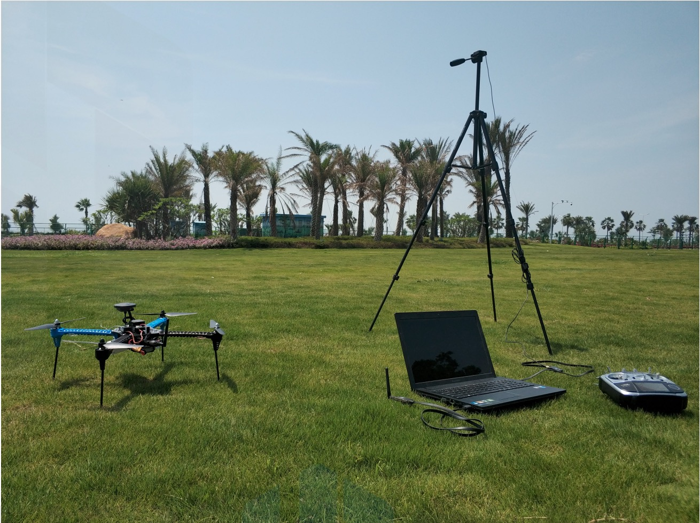

Please place the base station in an outdoor environment with sufficient sky coverage to obtain a good satellite signal. Place the base station on a stable and elevated platform, such as a tripod.

**Base Module Setting using Mission Planner**

Start with base module setup first. During the base station setup, the rover and the UAV do not need to be turned on.

Open the Mission Planner ground station software on your computer and go to the "initial setup → Optional Hardware → RTK/GPS Inject". You will see the following page:

Select the correct base module com port in the top left corner and click connect. In the SurveyIn Acc section, enter the absolute geographic accuracy that you expect your HERE + base station to achieve. In the Time column, enter the minimum survey time you expect. Click on Restart, the ground station will transfer the data you have entered to the HERE + base module, the base module will start a new round of surveying. You will see the following page:

During the survey process, the right box will show the current survey status: **Position is invalid:** base station has not yet reached a valid location;  
**In Progress:** survey is still in progress；  
**Duration:** The number of seconds that the current surveying task has been executed;  
**Observation:** the number of observations acquired;  
**Current Acc:** Absolute geographic accuracy that the current base station can achieve;  
**Green bar** at the lower part of the Mission Planner page shows the satellites being detected and the signal strength related to each satellite.

The base station needs a certain amount of time to meet the accuracy requirements of your input. Testing shows that, in an open area without shelter, to achieve the absolute accuracy of 2m takes a few minutes; to reach the absolute accuracy of less than 30cm takes around an hour; to reach the accuracy of 10cm takes a few hours.

It should be noted that the absolute geographic accuracy of the base station here will affect the absolute geographic accuracy of the rover module without affecting the relative accuracy between the base station and rover. If your application does not require UAV with high absolute geographic accuracy, you do not need to set the base station’s precision too high, resulting in long survey time.

Even if the accuracy of the base station is 1.5 to 2 m, the position accuracy of the rover module relative to the base station can still reach centimeter level.

After the survey is complete, Mission Planner will display the following page:

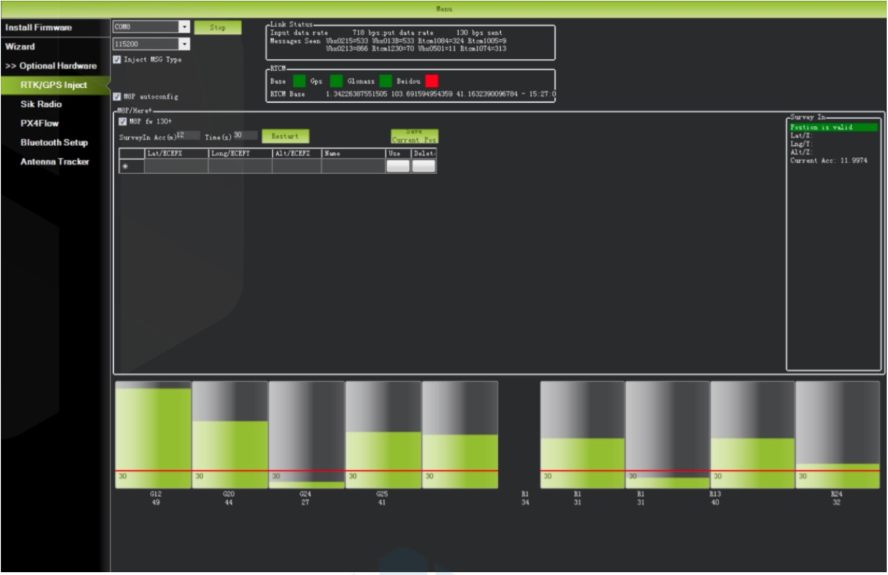

In the RTCM box it shows that the base status indicator is green and both the GPS and Glonass satellite systems are green \(if you want to change the satellite system, refer to the following section\). The box on the right says "Position is valid".

To store the current location in the Mission Planner: Click "Save Current Pos", enter a name in the dialog box, and click "OK". As shown below, you can see your saved location in the list. Click the "Use" button for the location you saved. The base station will enter the fixed mode and the status will show "Using FixedLLA". In the future, if you set the base station in the same location, you do not need to conduct survey again, just click the "Use" button that corresponds to the location you have saved.

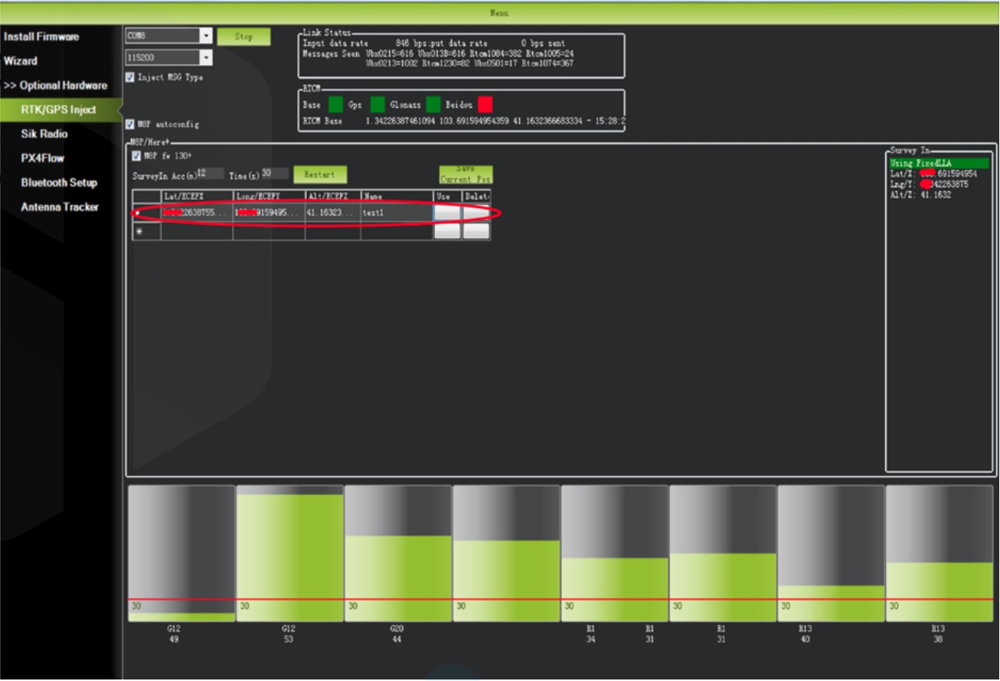

### Rover Module and Flight Controller Setup

After the base station is set up, you can turn on the UAV. Using the same Mission Planner to connect the telemetry module, the base station data will be transmitted through telemetry module to the HERE + rover module on the UAV. In the Mission Planner main page, you can see the current GPS status displayed as RTK Float / RTK Fixed / 3D RTK, indicating that the positioning of the UAV has entered the RTK mode. RTK Float is a floating-point solution; RTK Fixed is a fixed solution. RTK Fixed mode has a higher accuracy and requires better signal strength. 3D RTK is unified saying of RTK Float / RTK in the Mission Planner Chinese version.

### Single Base to Multiple Rovers

There are 2 methods to do this:  
1\) Use 1 telemetry to multiple telemetry broadcasting ;or  
2\) Use multiple 1 to 1 telemetry modules with USB hub

Ground station configuration: connect all telemetry modules to the computer via USB hub. Open Mission Planner to locate the base then connect it with flight controllers. Select AUTO connecting as shown below. All recognized flight controllers on the ports will be connected. You may select the UAV form the dropdown list below:

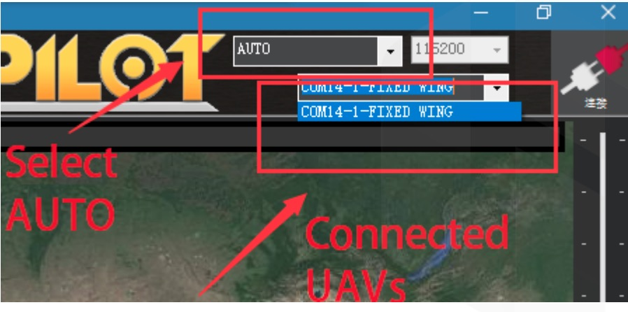

If you connected the UAVs with 1 telemetry module, they should share the same COM port:

### Use U-centre for Live Data Recording/Replaying

One function of the U-center is to record the base / rover module data for later analysis. Firstly, when the base or rover module is already connected to U-center \(in the same way it is connected when updating firmware\), click the following bug icon to turn on the "debug message":

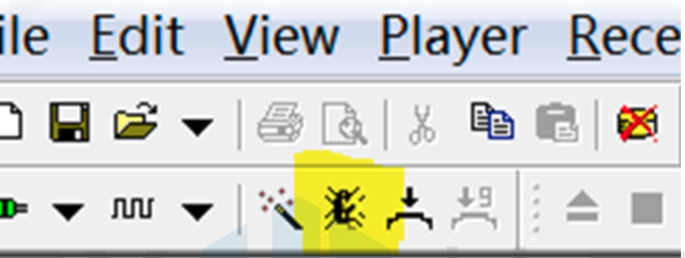

Then, click into "View → message view → UBX → RXM → RTCM\(RTCM input status\)", right click to "enable message".

Finally, click on the red recording icon on the upper left corner of the interface \(shown below\), select an address to save the recording, click OK, the recording will begin. When recording is stopped, the recording will appear in the previously saved address.

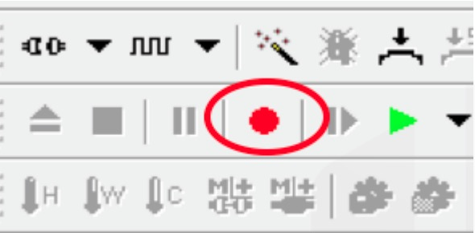

To play the recorded data, click the green play icon, select a playback speed, select the specified address of your stored data file, then the data will be played.

### Use U-Centre for Debugging/Advanced Configuration

### Check Status of Base Station

Connect the base module to U-center software, check the display box in the upper right corner of the interface, Fix Mode section is displayed as TIME. If Fix Mode does not enter TIME, the current state of the base station is not sufficient to allow the rover module to enter RTK mode. As shown in the figure below, Fix Mode is displayed in 3D mode, hence the RTK standard has not yet been reached.

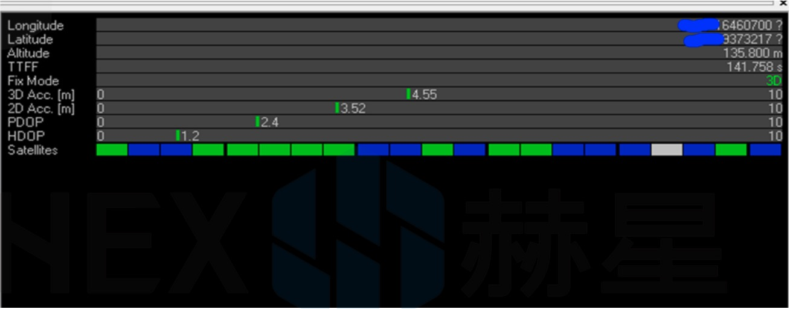

Possible reason for base station not entering TIME Mode:

1\) Signals received by base station is not strong enough. To check the satellite strength received by base station, see the bottom right corner of the software interface. The vertical bars in the box indicate satellites strength received by the current base station. A vertical bar represents a satellite \(GPS or Beidou / GLONASS, depending on the choice of satellite systems\).

TIME Mode of base station requires a\) 5 GPS satellites + 2 GLONASS satellites, with strength &gt; 40; b\) 5 GPS satellites + 3 Beidou satellites, with strength &gt; 40;

As shown in the figure below, only one satellite strength is higher than 40. Therefore, the signal condition does not meet the RTK standard.

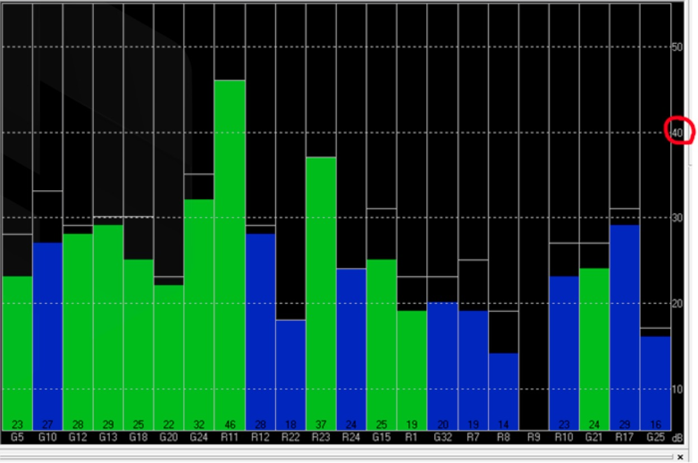

2\) The user input of survey-in accuracy requirement is too strict to achieve, or the base station has not yet completed the surveying process. Using U-centre for survey-in setup, please refer to later section in this chapter.

### Check whether Rover receives base correction data \(Timeout\)

After the base station enters the TIME Mode, it is necessary to transmit the RTCM data to the rover, for rover to enter RTK modes. Therefore, a real-time and efficient communication between rover and base station is necessary for good RTK positioning performance.

Check whether there is a delay in the data transmission between the mobile station and the base station, connect the rover module to U-center \(or replay the data log to inspect a previous operation\). Go to "View→Messages view→NMEA→GxGGA" directory to see Age of DGNSS Corr parameters. This parameter represents the time at which the rover did not receive the base station data. In the case of the default base station message frequency 1HZ, if this parameter exceeds 1s, there is a certain delay in the data transmission.

### Set Survey-in/Fixed Mode for Base Station

Similar to Mission Planner RTK Inject page, U-center can also be used to set the base station survey-in time and accuracy. Enter "View→Messages view →UBX→CGF→TMODE3". Select 1.Survey-in under the Mode drop-down option, and set the survey time \(and the minimum time required for the base station to survey\). The survey-in current status can be viewed in the "View→Message View→NAV→SVIN" page.

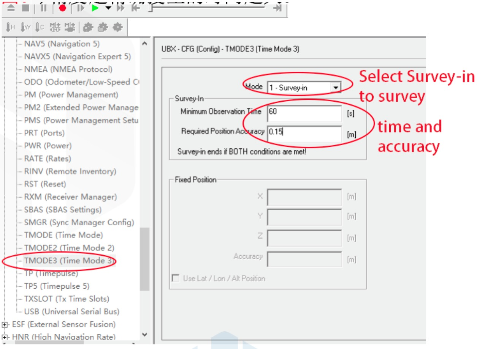

The base station can also be set to Fixed Mode. When the base station’s current precise geographic coordinates are known, the coordinates can be entered directly into the base station, which saves the time required for surveying. In the TMODE3 page, select Fixed mode in the drop-down list, and then enter the precise known base station coordinates.

After setting the survey or fixed mode, click the Send button at the bottom left of the page to transfer the modified data to the base station.

### Use Beidou/GLonass

The uBlox 1.30 firmware uses the GPS + GLONASS navigation system for location services by default. If you want to change to GPS + Beidou navigation system, you need to enter "View→Messages view→UBX→CGF→GNSS directory, cancel the tick on GLONASS Enable option, and then check the Beidou Enable option. After the selection, click "Send" to complete the change.

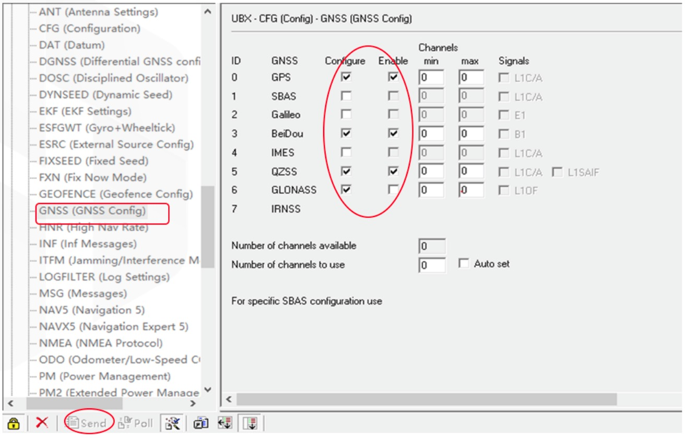

To save the current settings, go to "View→Messages view→UBX→CFG \(Configuration\)" page and click the Save current configuration option, then click Send \(as shown below\).

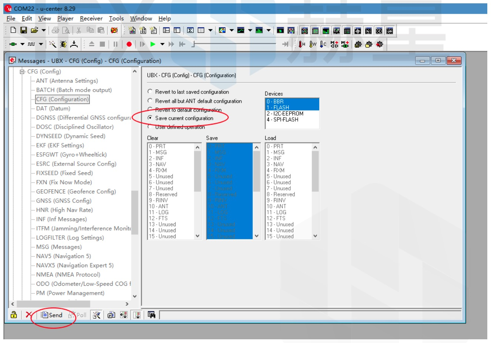

**Note:** Base station and rover should use the same navigation system configuration, or rover will not be able to enter RTK modes.

### Base Module I/O Port and Protocol Setup

u-blox M8P chip supports a variety of input and output protocols, including USB, UART, I2C and so on. The HERE + base station module uses the USB port for data communication and RTK outputs. If you need to confirm the current settings, go to "View→Messages view → UBX → CGF → PRT" and select 3-USB in the Target field. The correct input and output protocols are shown below:

If you want to use more output protocols \(such as UART\), you can also select the output protocol and a specific message combination on this page. If you want to set a string of specific messages to output under a variety of protocols, you can go to "View→Messages view → UBX → CGF → MSG" .Then select a specific message, and then check the type of protocol you want to output.

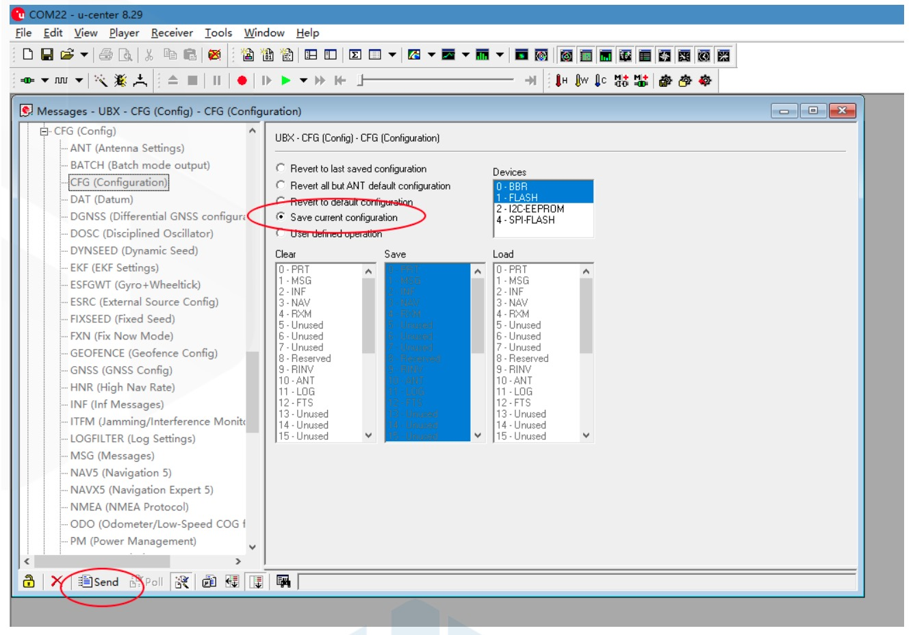

To save the current settings, go to "View→Messages view→UBX→CFG \(Configuration\)" and click the "Save" current configuration option, then click Send.

### Change Rover Module Output Rate

By default, the output frequency of the position information by the rover module is 1HZ. If you need to speed up the position output frequency, you can enter "View→Messages view→UBX →CGF→RATE" and modify "Measurement Period". For example, adjust "Measurement Period" to 200ms then the "Measurement Frequency" will be increased to 5Hz.

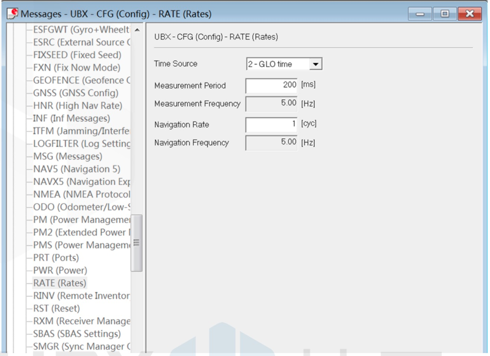

To save the current settings, go to "View→Messages view→UBX→CFG \(Configuration" and click the Save current configuration option, then click Send.

### Change Base Antenna and Testing

HERE + base module antenna is a Taoglas antenna. Users can select different antennas according to their needs and connect them to base module. We have conducted a test of three different antennas in an outdoor environment, where three antennas at the same time, same location were connected to the HERE + base station, data were logged using Ucentre recording function.

**It should be noted that** the following data are not sufficient to give a comprehensive conclusion about which antenna is better, but the user can use the following methods to test, compare different antennas to find he one more suitable for their application.

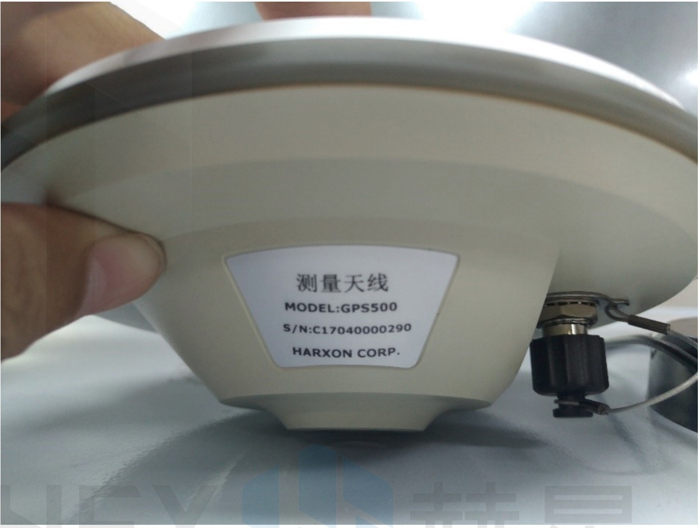

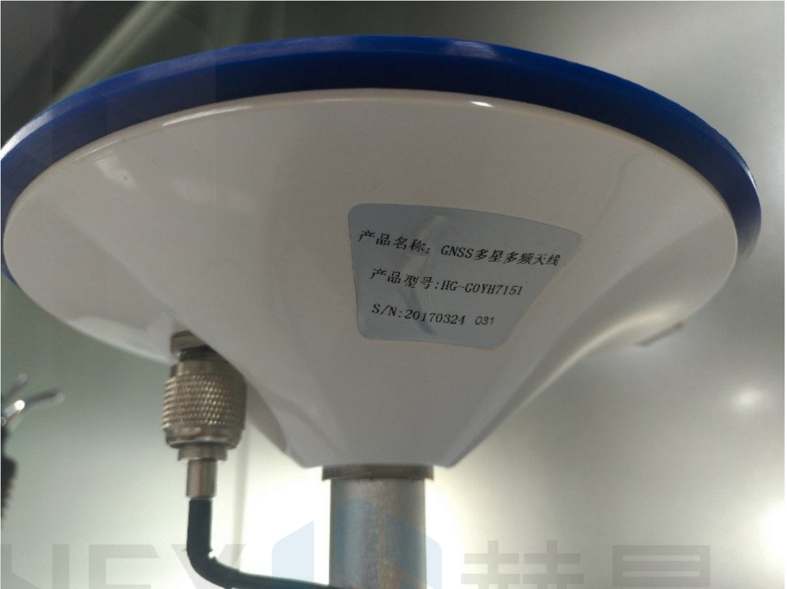

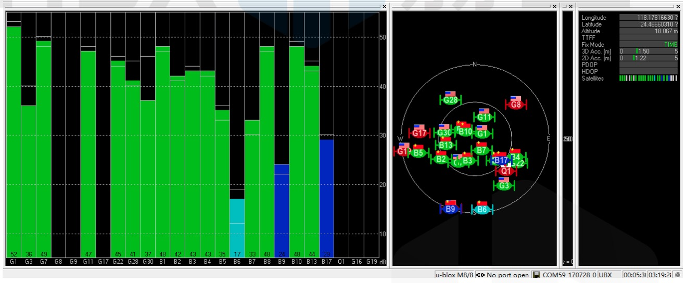

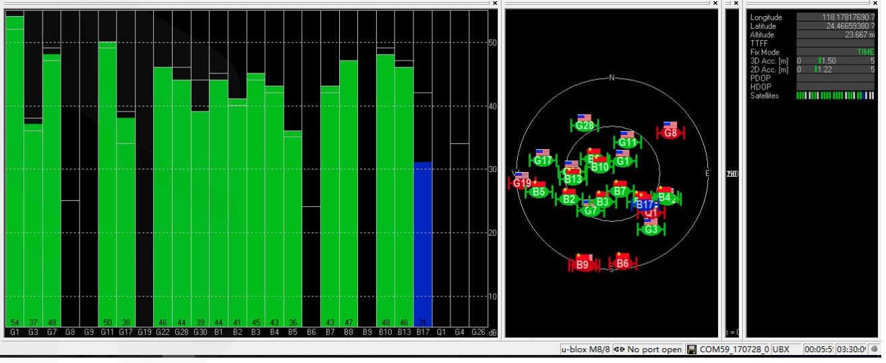

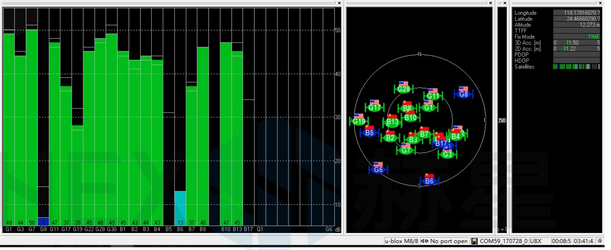

Last update: 9th Jan 2019

\*\*\*\*
